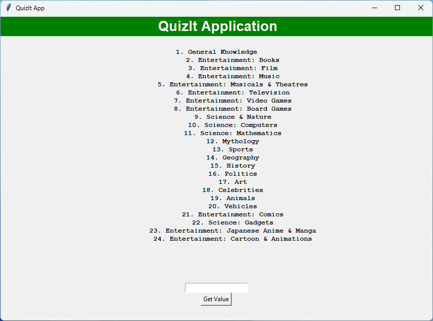
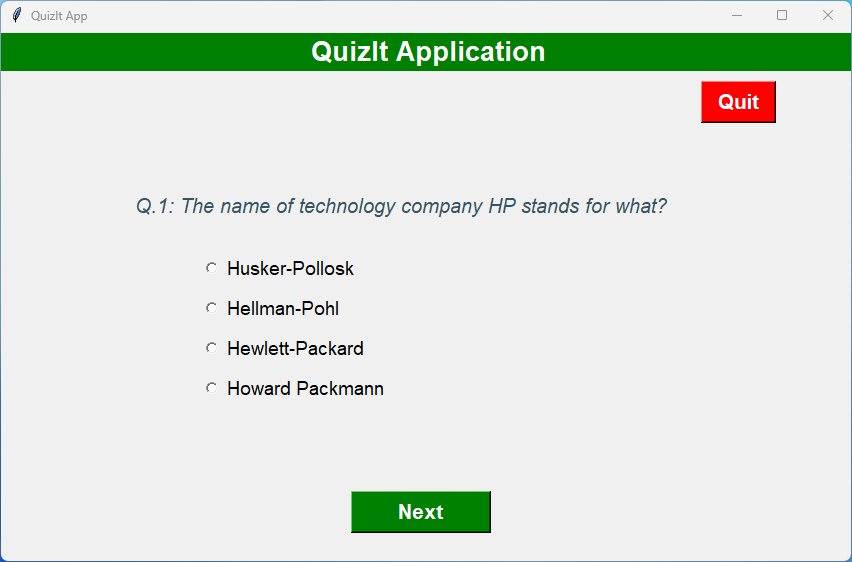
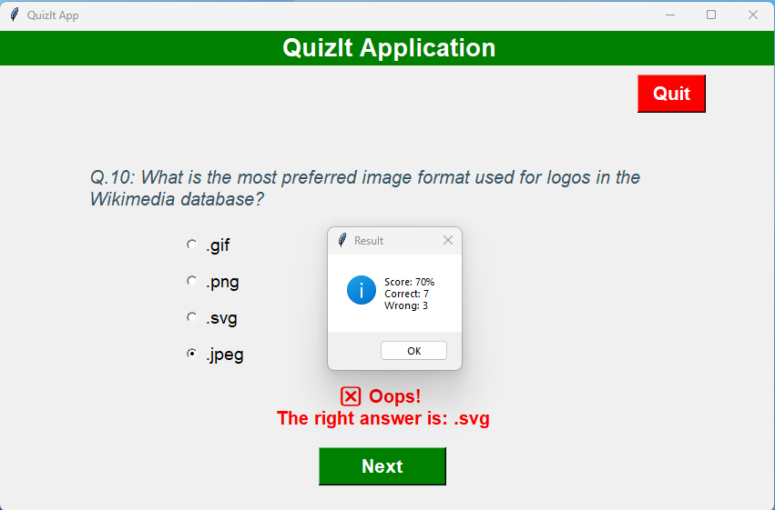

# QuizIt App

## Overview
This is a simple quiz application that fetches questions from the [Open Trivia Database](https://opentdb.com/) API based on user-selected topics. It presents the questions to the user and allows them to select their answers. Once the quiz is completed, the user's score is displayed.

## How to Run
To run the quiz app, follow these steps:

1. Clone the repository to your local machine.
2. Install the required dependencies by running `pip install -r requirements.txt`.
3. Run the `main.py` file using Python.
4. Click the "Start" button to begin the quiz.
5. Select the desired topic from the dropdown menu.
6. Answer the questions presented to you.
7. Once you've completed the quiz, your final score will be displayed.

## Features
- Fetches questions from the Open Trivia Database API.
- Supports multiple choice questions.
- Displays questions one at a time.
- Randomizes the order of answer choices.
- Tracks the user's score and progress.
- Provides a simple user interface for interacting with the quiz.

## Dependencies
- Python 3
- requests library (for API requests)
- Streamlit (for the user interface)

## Project Structure
- `main.py`: Main script to run the quiz app.
- `question_model.py`: Defines the Question class.
- `quiz_brain.py`: Implements the QuizBrain class for quiz logic.
- `quiz_ui.py`: Defines the QuizInterface class for the user interface.
- `input_window.py`: Implements the InputWindow class for selecting quiz topics.
- `requirements.txt`: Lists the required Python libraries.

## Screenshots

### Category Selection Screen

*Description: This screenshot features the category selection screen in the QuizIt Application. Users can choose from a wide range of categories, including General Knowledge, various Entertainment categories (Books, Film, Music, etc.), different Science categories (Nature, Computers, Mathematics, etc.), and more. There is a total of 24 categories listed, and users can click the "Get Value" button to proceed with their selection.*

### Question Screen

*Description: This screenshot displays the questions of a quiz within the QuizIt Application. The user can select an option and click "Next" to proceed to the next question. The interface includes a "Quit" button at the top right corner.*

### Result Screen

*Description: This screenshot shows the feedback provided after answering all the questions in the QuizIt Application and displays a result window showing the user's score.*

## License
This project is licensed under the [MIT License](LICENSE).
